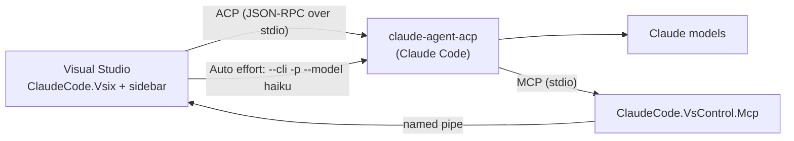

# Claude Code for Visual Studio

**A native Claude Code sidebar for Visual Studio 2022/2026.** Chat with Claude Code in a docked
tool window next to Solution Explorer, review its edits and plans, and let it build, debug and drive
the IDE — without leaving Visual Studio or switching to a terminal.

[](https://github.com/edgarus-labs/claude-code-vs/actions/workflows/ci.yml)
[](https://github.com/edgarus-labs/claude-code-vs/actions/workflows/cd.yml)
[](https://github.com/edgarus-labs/claude-code-vs/releases/latest)
[](https://visualstudio.microsoft.com/)
[](https://dotnet.microsoft.com/)
[](https://agentclientprotocol.com)
[](LICENSE.txt)

## Contents

- [Why this project exists](#why-this-project-exists)
- [What you get](#what-you-get)
- [Requirements](#requirements)
- [Installation](#installation)
- [Getting started](#getting-started)
- [Using the sidebar](#using-the-sidebar)
- [Auto effort](#auto-effort)
- [How it works](#how-it-works)
- [Development](#development)
- [Security and privacy](#security-and-privacy)
- [Contributing](#contributing)
- [License](#license)

## Why this project exists

Anthropic ships Claude Code as a CLI and as an extension for VS Code, but not for Visual Studio.
.NET developers who live in Visual Studio otherwise have to run Claude Code in a separate terminal:
it cannot see the editor's unsaved buffers, cannot build or debug the solution through the IDE, and
its edits, plans and permission prompts arrive as terminal text instead of as diffs and dialogs.

This extension closes that gap. It is a native WPF tool window built on the open
[Agent Client Protocol](https://agentclientprotocol.com) (ACP, JSON-RPC 2.0 over stdio) — the same
protocol other Claude Code clients use — rather than a terminal wrapper or a port of the VS Code
extension. Claude Code itself runs out of process through the `claude-agent-acp` adapter; the
extension renders its responses, diffs, plans and tool calls in Visual Studio, brokers its file
access, asks you for permissions, and gives it tools to operate the IDE.

Features follow what the adapter advertises; this is not a claim of feature parity with Anthropic's
official extensions.

## What you get

- **Chat in the IDE** — streaming Markdown, attachable editor documents (including unsaved edits)
  and images, slash commands, session history and resume.
- **Models, effort and modes** — every model and effort level the adapter offers, **Auto effort**
  that picks Low, Medium or High for each message, and the Manual / Accept edits / Plan / Auto
  permission modes.
- **Reviewable changes** — every file Claude edits is listed with per-file or bulk accept/reject,
  and in Plan mode the plan opens as a document you approve or send back with comments.
- **Claude drives Visual Studio** — open files, read the selection, build, rebuild or clean, read the
  Error List and Output panes, and run a full debugging loop, including UI Automation of the app
  being debugged.
- **Stays in the loop** — elapsed time, token usage, context-window fill, account usage limits,
  background notifications, and Remote Control from [claude.ai/code](https://claude.ai/code).
- **Your existing sign-in** — authentication is delegated to Claude Code's own CLI; the extension
  never reads or stores your credentials.

## Requirements

- Visual Studio 2022 or 2026 with the **.NET 8.0 Runtime (Long Term Support)** individual component
  (see [Installation](#installation)).
- [Node.js](https://nodejs.org) 22 or newer.
- The ACP adapter `@agentclientprotocol/claude-agent-acp` (installed below) and a Claude Code
  sign-in.

## Installation

1. Install the adapter the extension talks to:

   ```powershell
   npm install -g @agentclientprotocol/claude-agent-acp
   ```

   To upgrade later, run `npm install -g @agentclientprotocol/claude-agent-acp@latest`. New models
   appear in the model picker once the adapter supports them (Claude Opus 5.5 needs 0.81.0 or newer).
2. Make sure the target Visual Studio installation has the **.NET 8.0 Runtime (Long Term Support)**
   component (`Microsoft.NetCore.Component.Runtime.8.0`): **Visual Studio Installer → Modify →
   Individual components**. A separately installed .NET runtime does not satisfy this prerequisite;
   the component runs the helper process that lets Claude drive Visual Studio. Update an older Visual
   Studio if the component is not offered.
3. Download the `.vsix` from the [latest release](https://github.com/edgarus-labs/claude-code-vs/releases/latest),
   open it, select your Visual Studio installation in the VSIX Installer, close Visual Studio when
   prompted, and start it again.

Restart Visual Studio after installing Node.js or the adapter, or after changing environment
variables, so it inherits the updated `PATH`. If the adapter is not on `PATH`, set its location
under **Tools > Options > Claude Code > ACP executable path**.

## Getting started

1. Open the sidebar: **View > Other Windows > Claude Code**, or **Window > Claude Code > Claude Code
   Chat**.
2. Sign in if the sidebar asks you to: type `/login`. A console opens running the adapter's bundled
   Claude Code CLI (`claude-agent-acp --cli auth login --claudeai`), which completes the OAuth flow in
   your browser. If you already signed in with `claude auth login` in a terminal, use **Check CLI
   sign-in** instead. Credentials, including `CLAUDE_CONFIG_DIR`, are Claude Code's own.
3. Pick a model and effort in the model picker, type a message and press Enter.

Permission requests are interactive: choosing **Yes** approves only that request. `/logout` signs out
of Claude Code everywhere on this machine (CLI, VS Code and other clients too), after a confirmation.

## Using the sidebar

### Chat and context

- **Compose:** Enter sends, Shift+Enter inserts a newline. Messages sent while Claude is working are
  shown immediately and delivered in order.
- **Documents:** **+** attaches the active editor document, including unsaved edits. Switch tabs and
  press **+** again to attach several; attaching the same file again replaces its snapshot, so press
  **+** again to refresh it after further edits.
- **Images:** use the image button or paste an image with Ctrl+V.
- **Slash commands:** type `/` to filter the adapter's command catalog, plus the sidebar's own
  `/login` and `/logout`. Up/Down select, Tab or Enter insert without sending, Escape dismisses. Skill
  and plugin commands appear as the adapter advertises them; manage plugins with the Claude Code CLI.
- **Reading and copying:** your messages appear as bubbles, Claude's answers as selectable Markdown
  with tables and code blocks. Copy copies the original text, not the rendering. Markdown images show
  their alt text; their URLs are never fetched.
- **Text size:** Ctrl+mouse wheel over the composer or an answer changes the chat font size from 10
  to 28 (default 13) for the current session, without touching the editor zoom.
- **History:** the clock button lists this workspace's sessions, filterable by title or id. The header
  shows the current session's title.

### Models, effort and modes

- **Model and effort:** the picker lists exactly what the adapter advertises for the current model;
  the extension has no model list of its own. Changes apply to the running session and can be made
  while Claude is working.
- **Auto effort:** the Effort list offers **Auto** ahead of the adapter's levels. Each message is then
  judged and runs at Low, Medium or High; once judged, the picker shows the level in effect, for
  example `Opus · Auto · High`. See [Auto effort](#auto-effort).
- **Modes:** **Manual** asks before every change, **Accept edits** applies file edits without asking,
  **Plan** has Claude plan before changing anything, and **Auto** runs without asking. The **Auto
  mode** decides *permissions*; **Auto effort** decides *how much reasoning* a message gets — they
  are independent.

### Plans, tasks and changed files

- **Implementation plan:** in Plan mode, when Claude asks to approve its plan, an **Implementation
  Plan** document tab opens next to your code. **Proceed** approves it; **Review** sends your comments
  back so Claude revises the plan first.
- **Tasks and changed files:** Claude's task list and every file it edited in this session appear as
  cards above the composer. Open, accept (keep) or reject (restore the pre-edit content) each file,
  or use **Accept all** / **Reject all**. The list resets when you start or resume another session.

### Claude drives Visual Studio

Every session gets MCP tools that act on the live Visual Studio instance:

- open and activate files, read the active document and selection, add files to projects and
  projects to the solution;
- **build / rebuild / clean** the solution or one project, and read the **Error List**, editor
  squiggles and any **Output** pane;
- a full **debugging loop**: set breakpoints, start the startup project under the debugger, wait for
  a break, inspect the call stack, locals and expressions, step, continue and stop;
- while the app runs, list its windows, read their UI Automation tree, click buttons, toggle check
  boxes, type into text boxes and take screenshots — only windows of the debugged process.

In Manual mode each call asks for permission first. [docs/VsControlProtocol.md](docs/VsControlProtocol.md)
lists every tool and describes the trust boundary.

### Status, usage and notifications

- **Status:** while Claude works the transcript shows elapsed time, the turn's tokens and the current
  activity; the ring next to the model shows how full the context window is (hover for numbers).
- **Usage limits:** the gauge button opens the account's session and weekly limits. Behind a proxy,
  set `HTTPS_PROXY`/`HTTP_PROXY` for Visual Studio and use Node.js 24 or newer, the first release whose
  HTTPS client honours them.
- **Notifications:** when Visual Studio is in the background, a Windows notification appears when
  Claude finishes, needs a permission or has a plan to review; click it to jump back. Turn it off under
  **Tools > Options > Claude Code > Notify when Visual Studio is in the background**.
- **Remote Control:** the **Remote Control** pill lets you drive the session from
  [claude.ai/code](https://claude.ai/code) (the same bridge as the CLI's `--remote-control`); the link
  button opens this session there. **Tools > Options > Claude Code > Remote Control at startup** turns
  it on for every new session. This needs the npm-installed adapter.

## Auto effort

Effort is how much reasoning Claude spends on a message. A fixed level is either wasteful — High for
`git status` — or too shallow — Low for a deadlock hunt — and switching it by hand for every message is
tedious. **Auto** picks the level per message, so simple requests come back fast and hard problems get
the reasoning they need.

**What it chooses.** Auto answers one question about the current message: how open-ended is the
problem — is the fix or design already given, or which causes or designs remain open?

| Level | When | Examples |
|---|---|---|
| Low | One obvious solution, applied mechanically: target, mapping or fix given. | `git status`, commit and push, rename a variable |
| Medium | A few candidates in one place, or one small trap. | which line breaks a test, one boundary case |
| High | Several viable designs or candidate causes. | authentication, a deadlock, a flaky integration test |

Volume of work and wording never raise the level, and when torn between two levels Auto picks the
lower one. It works in any language. Auto never goes above High; higher levels (such as Extra High or
Max) stay an explicit choice, and picking any explicit level behaves exactly as before. Auto is offered
only when the adapter advertises `low`, `medium` and `high`.

**How it decides.** The approach follows the `auto` thinking level of
[oh-my-pi](https://github.com/can1357/oh-my-pi) (`packages/coding-agent/src/auto-thinking`). A judge —
Claude Haiku, run through the adapter's bundled Claude Code CLI
(`claude-agent-acp --cli -p --model haiku`) with your existing sign-in — answers `low`, `medium` or
`high`. The judge has no tools, no settings, no saved session and no reasoning budget; only the current
message is judged, never the conversation. The message is cleaned first to cut noise (ANSI escapes,
tool/XML envelopes and fenced code removed, commit hashes shortened, at most 2,000 characters keeping
both ends; this is not redaction) and passed on standard input as data to judge, never as instructions.
The Auto choice survives an agent reconnect but is not remembered beyond the tool window: a new tool
window or Visual Studio session starts on a manual level.

**What it costs.** Each Auto message makes one small Haiku request against your Claude plan — up to
three when the judge's reply has no usable level and is retried — and adds a few seconds (a CLI start
plus the model round trip) before the message is sent. No API key and no extra configuration are
needed.

**How it stays correct.** Auto is a client-side mode: the adapter never receives an `auto` value. The
chosen level is set through ACP and acknowledged before the message is sent. Effort applies to the
whole session, so messages typed while an Auto message is running wait for it and then go one at a
time, each with its own level. If the judge gives no usable answer (after two retries), fails, or takes
longer than 15 seconds, the message keeps the last level Auto chose — High before the first — and the
status line says why.

## How it works



- The extension starts `claude-agent-acp` per chat session and speaks ACP to it over stdio: prompts,
  streamed updates, tool calls, permission requests, file reads/writes and session configuration.
- Each session also starts `ClaudeCode.VsControl.Mcp`, a small MCP server the agent calls for Visual
  Studio tools; it forwards each call over an access-controlled named pipe to the extension, which runs
  it on the UI thread ([docs/VsControlProtocol.md](docs/VsControlProtocol.md)).
- Sign-in, sign-out and the Auto effort judge run the adapter's bundled Claude Code CLI; the account
  usage lookup runs in a short-lived Node.js subprocess.

| Project | TFM | Role |
|---|---|---|
| `src/ClaudeCode.Contracts` | netstandard2.0 | Cross-project interfaces and DTOs (ACP connection, auth, MCP config, Auto effort) — the only thing every other project depends on. |
| `src/ClaudeCode.Acp` | netstandard2.0 | ACP client: JSON-RPC/stdio transport, process spawning, adapter resolution, and the Auto effort judge. |
| `src/ClaudeCode.Core.ViewModels` | netstandard2.0 | XAML-free chat view models, including the per-turn effort and send sequencing. |
| `src/ClaudeCode.Core` | net472 + WPF | The sidebar UI (`ChatPanelView` and friends). |
| `src/ClaudeCode.VsControl.Mcp` | net8.0 (exe) | Standalone MCP-over-stdio server; forwards tool calls to Visual Studio over a named pipe. |
| `src/ClaudeCode.Vsix` | net48 | The VSIX package: `AsyncPackage`, tool windows, commands, options, sign-in status, theme bridge and the named-pipe server. |

Tests live in `test/ClaudeCode.Acp.Tests`, `test/ClaudeCode.Core.Tests` and
`test/ClaudeCode.VsControl.Mcp.Tests`; the transcript renderer's JavaScript is tested with
`node --test test/transcript/render-diff.test.js`.

## Development

### Building

The protocol, view-model and MCP projects and their tests build with the .NET SDK on any platform.
**Building the full solution and producing the `.vsix` requires Windows with Visual Studio 2022/2026
and the "Visual Studio extension development" workload**; packaging uses desktop MSBuild and fails
explicitly if the VS SDK targets cannot be loaded.

```powershell
dotnet restore ClaudeCodeVS.slnx --locked-mode
msbuild ClaudeCodeVS.slnx -t:Build -p:Configuration=Release
# the .vsix lands in src/ClaudeCode.Vsix/bin/Release/net48/
```

### Debugging

F5 on `ClaudeCode.Vsix` launches a separate **Experimental Instance** with its own extension
installation; testing there does not update the extension in your regular Visual Studio. To use a
rebuilt version normally, install the new `.vsix` as described in [Installation](#installation).

### CI/CD

- **CI** (`.github/workflows/ci.yml`): every pull request and every push to `develop` builds the full
  solution in Release on `windows-latest` and runs all test projects.
- **CD** (`.github/workflows/cd.yml`): pushing a tag `vX.Y.Z` stamps that version into the
  `.vsixmanifest` `Identity/@Version` (what Visual Studio's Extensions dialog shows) and the assembly
  metadata, rebuilds, re-runs the tests, and uploads the `.vsix` and its `SHA256SUMS` as the run's
  `release-vsix` artifact. Two independent jobs then publish it:
  - **release** creates a **draft** GitHub Release with both files; a maintainer reviews and publishes
    it by hand;
  - **marketplace** publishes the `.vsix` to the Visual Studio Marketplace under the publisher
    `edgarus-labs` (`src/ClaudeCode.Vsix/publishManifest.json`, which must match the `.vsixmanifest`
    `Identity/@Publisher`), using the `VS_MARKETPLACE_PAT` repository secret. A missing token, a
    publisher mismatch or a rejected upload fails the job.

  If a publishing job fails, the `release-vsix` artifact stays available: fix the cause and use
  **Re-run failed jobs**, which repeats only the failed job (a re-run of **release** reuses the
  existing draft).
- **CodeQL** (`.github/workflows/codeql.yml`): pull requests to `develop`, pushes to `develop` and a
  weekly schedule run CodeQL over C#, the JavaScript transcript renderer and the workflows; results
  appear under **Security → Code scanning**.

## Security and privacy

The extension handles prompts, attached documents and images, editor contents (including unsaved
edits), file paths and tool results. They are passed to the ACP agent and on to its model provider;
with Auto effort, each message is additionally sent to Claude Haiku to judge its effort. The extension
never reads or stores your Claude credentials: sign-in and sign-out run Claude Code's own CLI, and the
one component that reads an OAuth token — the usage-limit lookup — does so in a short-lived
subprocess that returns only the trimmed usage JSON. See [SECURITY.md](SECURITY.md) for the full scope
and how to report a vulnerability.

## Contributing

Issues and pull requests are welcome. For anything beyond a small fix, please open an issue first to
discuss the change. [AGENTS.md](AGENTS.md) describes the engineering conventions this repository holds
to: TDD, SOLID, Occam's razor and Conventional Commits.

## License

MIT — see [LICENSE.txt](LICENSE.txt).
